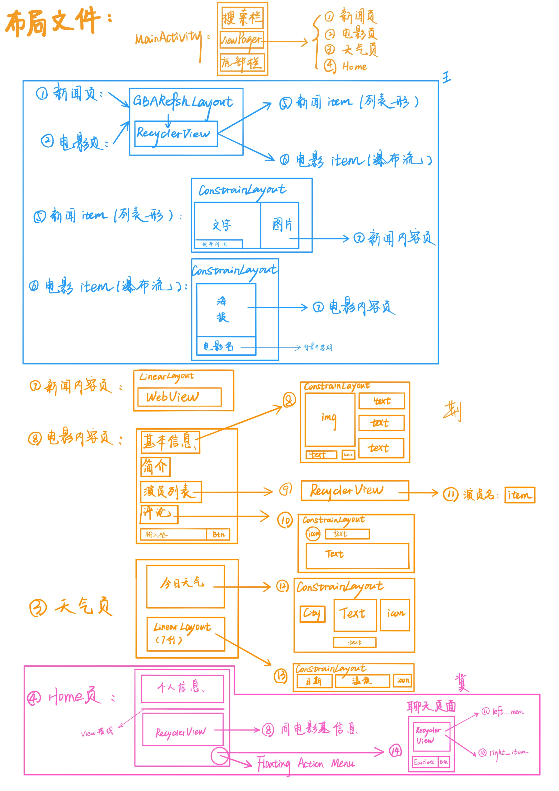
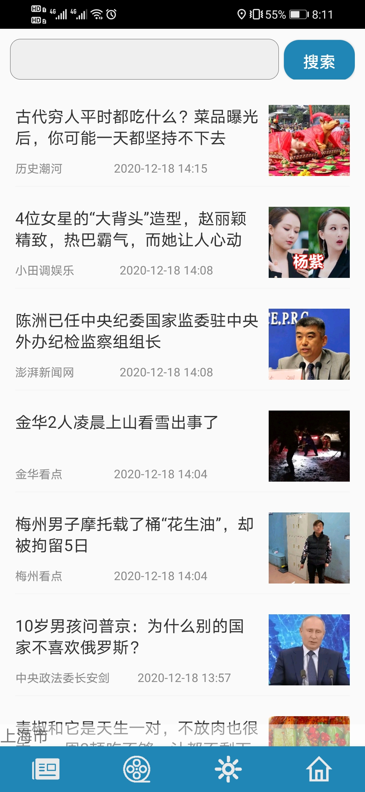
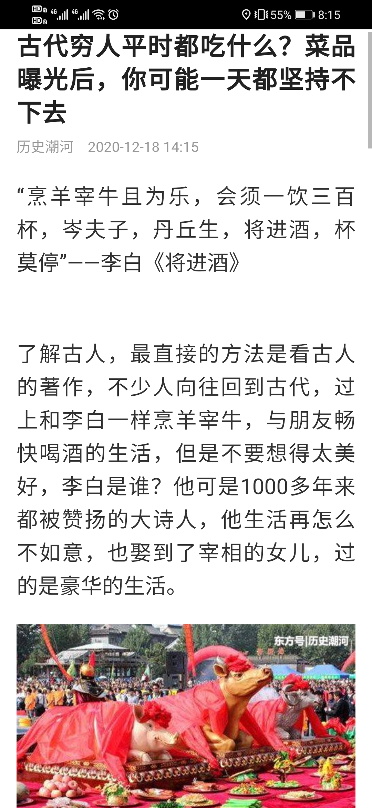
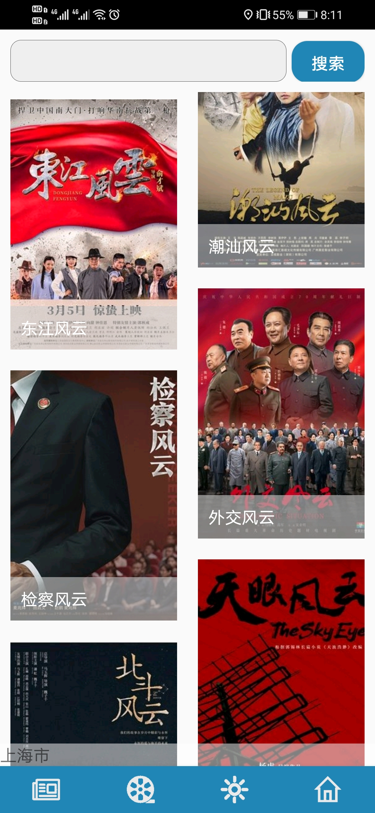
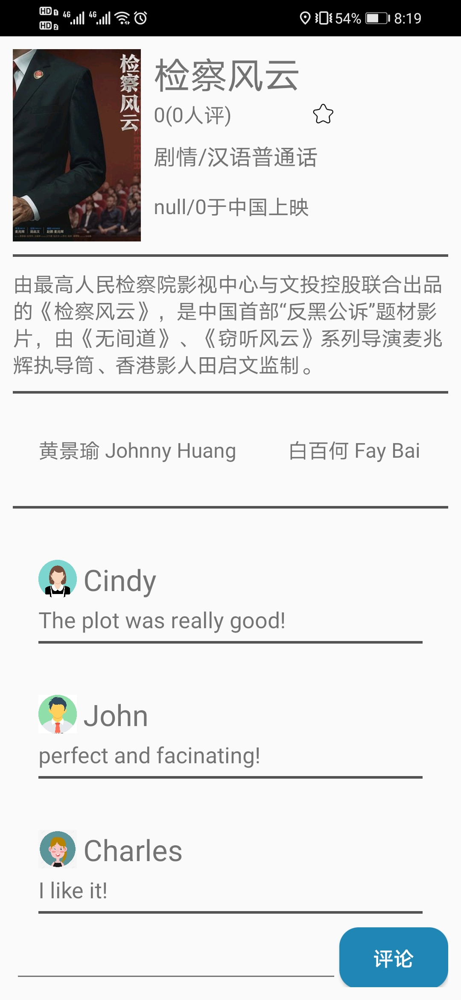
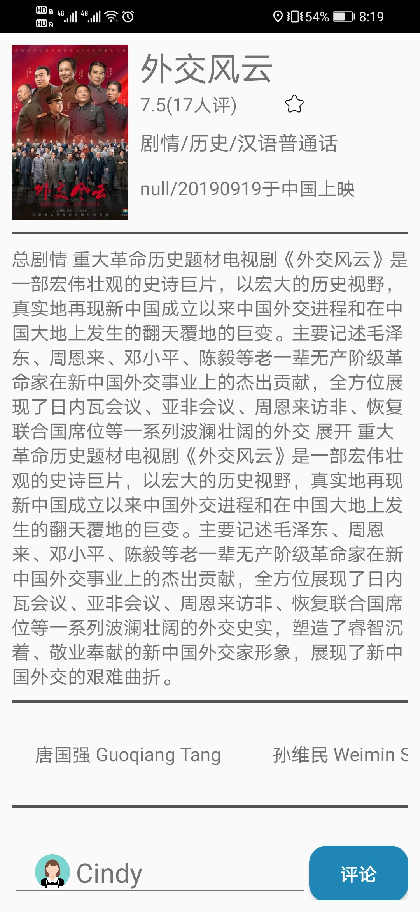
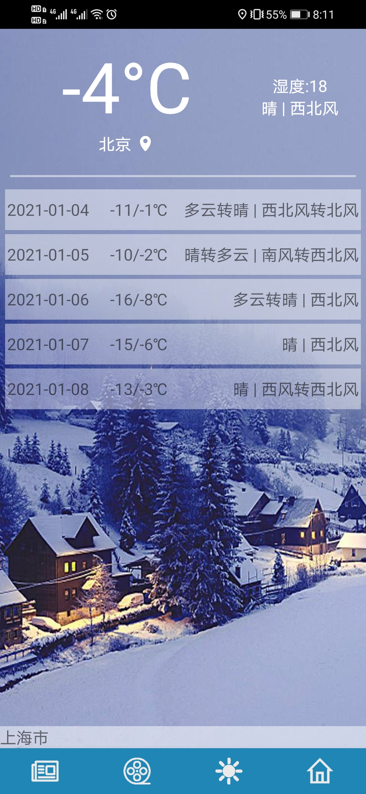
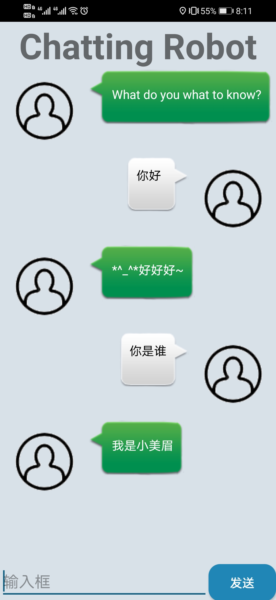

# Android资讯类App结课作业

## apk下载地址

[秃秃](https://github.com/WOC-BUG/AndroidApp/releases/tag/v2.0)

## 设计

## XML文件结构

## UI界面

### 首页面显示新闻

### 新闻内容

### 电影列表

### 电影内容

### 天气页

### 个人主页

### 机器人聊天页

